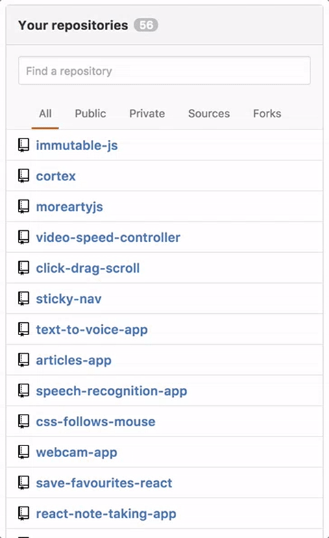

# GitHub 'Your Repositories' Widget in React

A clone of GitHub's 'Your Repositories' Widget built in React.

Live version: https://github-your-repositories.herokuapp.com

This project was bootstrapped with [Create React App](https://github.com/facebookincubator/create-react-app).
